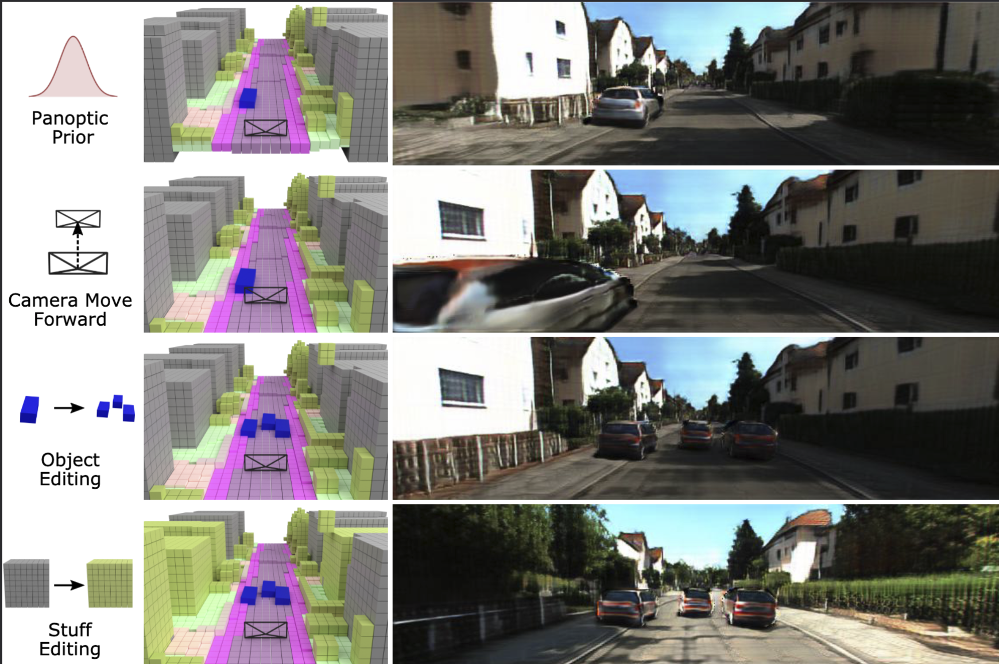

# 
# UrbanGIRAFFE: Representing Urban Scenes as Compositional Generative Neural Feature Fields <br><sub>Official PyTorch implementation of the UrbanGIRAFFE@ICCV2023</sub>

>

**Figure:** *Overview of UrbanGIRAFFE.*

> **UrbanGIRAFFE**: Representing Urban Scenes as Compositional Generative Neural Feature Fields 
<br>
> Yuanbo Yang, Yifei Yang, Hanlei Guo, Rong Xiong, Yue Wang, Yiyi Liao <br>

[[Paper](https://arxiv.org/abs/2303.14167)]
[[Project Page](https://lv3d.github.io/urbanGIRAFFE/)]

This work presents UrbanGIRAFFE: Representing Urban Scenes as Compositional Generative Neural Feature Fields. We uses a coarse 3D panoptic prior, including the layout distribution of uncountable stuff and countable objects, to guide a 3D-aware generative model. Our model is compositional and controllable as it breaks down the scene into stuff, objects, and sky. Using stuff prior in the form of semantic voxel grids, we build a conditioned stuff generator that effectively incorporates the coarse semantic and geometry information. The object layout prior further allows us to learn an object generator from cluttered scenes. With proper loss functions, our approach facilitates photorealistic 3D-aware image synthesis with diverse controllability, including large camera movement, stuff editing, and object manipulation. We validate the effectiveness of our model on both synthetic and real-world datasets, including the challenging KITTI-360 dataset.

## News
- [2023/10]: Code release. 
- [2023/07]: 🔥 UrbanGIRAFFE is accepted by [ICCV 2023](https://iccv2023.thecvf.com/)
- [2023/03]: Our paper is on [arxiv](https://arxiv.org/abs/2303.14167).

## TODO

- [x] Code release.
- [ ] Documents for Installation & Dataset Preparation
- [ ] Rendering scripts on KITTI-360 & Clevr-W.
- [ ] Training scripts.
- [ ] Rendering scripts on KITTI.

## Install 

See [Getting Start](./docs/dataset_preparation.md) for details.

## Data Prepre

See [Getting Start](./docs/dataset_preparation.md) for details.

## BibTeX

If this work is helpful for your research, please cite the following BibTeX entry.

```bibtex
@InProceedings{Yang_ICCV2023,
    author    = {Yuanbo Yang and Yifei Yang and Hanlei Guo and Rong Xiong and Yue Wang and Yiyi Liao},
    title     = {UrbanGIRAFFE: Representing Urban Scenes as Compositional Generative Neural Feature Fields},
    booktitle = {ICCV},
    year      = {2023},
}
```


